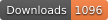

## 🎮 StreamLight

[](https://github.com/FoggyBytes/StreamLight) [](https://www.qt.io/) [](https://github.com/FoggyBytes/StreamLight/releases) [](https://github.com/moonlight-stream/moonlight-qt) [](https://claude.ai/code)

<div align="center">
  
</div>

**StreamLight** is the client-side half of the FoggyBytes streaming duo: the official FoggyBytes fork of [Moonlight](https://github.com/moonlight-stream/moonlight-qt) with native integration for its host-side companion, [**StreamTweak**](https://github.com/FoggyBytes/StreamTweak). It adds host NIC control, live host metrics in the overlay, store badges on game covers, session-quality reporting, remote Windows Update, and Tailscale presence — all driven from the client over a local TCP bridge to StreamTweak. From **3.0.0** the entire UI has been redesigned from the ground up with a flat, gamepad-first look inspired by the Xbox and Steam Big Picture interfaces, while the underlying streaming engine (FFmpeg / D3D11VA / DXVA2 / libplacebo / `moonlight-common-c`) is unchanged from 2.3.1.

<div align="center">
  
</div>

<div align="center">
  
</div>

## ✅ Compatibility

Windows 10 and 11. Works as a standalone Moonlight-compatible client against any Sunshine / Apollo / Vibeshine / Vibepollo host, **and** unlocks its full feature set when paired with [**StreamTweak**](https://github.com/FoggyBytes/StreamTweak) on the host PC (Tailscale, live NIC speed transitions, host metrics overlay, store badges, session-quality reporting, remote pause, remote host power-off, remote Windows Update).

> 🔐 **Authenticated bridge (3.1.0+).** Every command StreamLight sends to StreamTweak is signed with its existing Moonlight identity certificate; the host approves each client once via a 4-digit PIN confirmation. **Authorization never affects streaming** — without it you can still stream normally, you only lose the StreamTweak integration: host metrics overlay, NIC speed & Streaming Mode, store badges on covers, session quality reports & live charts, Tailscale, remote pause, remote host power-off, and remote Windows Update. Each host card shows its access state (AUTHORIZED / PENDING / DENIED) as a badge. As of StreamTweak 7.2.0 this authentication is mandatory (the host no longer has an option to disable it). Requires **StreamTweak 7.3.0 or later** on the host for the latest features (remote Windows Update, update-and-shut-down) and for the advanced integration in general; update both apps together.

> ⚠️ **Not affiliated with or endorsed by the Moonlight project.** StreamLight is an independent fork. For upstream Moonlight support, use the [official client](https://github.com/moonlight-stream/moonlight-qt).

## 🔥 Features

**🕹️ Gamepad-First UI** *(new in 3.0.0)*
- Every action is reachable from the pad: D-pad navigation across host cards, app grid, settings tabs, and dialogs
- Contextual gamepad prompts in a clickable bottom status bar (A / B / X / Y / LB / RB), every prompt also clickable with the mouse
- Glyphs swap automatically between **Xbox** and **PlayStation** icons based on the connected controller (DualSense / DualShock / Xbox / generic)
- App list sort order: Desktop first, Steam Big Picture second, all others alphabetically

**🏠 Home & App Grid**
- Portrait host cards with per-host coloured gradient headers and an inline **+ Add Hosts** tile
- Per-card **Options** chooser *(a wide tile grid as of 3.3.0)*: All Apps, Tailscale, Test Network, Rename, Delete, Details, **StreamTweak Streaming Mode**, Power…, Windows Update, Wake
- Compact one-row header in the app grid: `hostname · ONLINE · IP · NIC speed · resolution · FPS`
- 200×267 covers with store badges and a tight bright-green focus border; the running app's cover gets a thicker, pulsing border
- App-name tooltip appears **instantly** below the cover, anchored outside the focus frame

**⚙️ Settings**
- 6 tabs (Video / Audio / Input / Decoder / Network / Session) with bold uppercase labels and LB/RB tab cycling
- Pill-style **segmented selectors** replace every dropdown — D-pad ◀ / ▶ pick the value, no popup, no focus leak
- Inline subtitles replace hover tooltips; legacy copy reviewed and shortened
- **Bitrate slider** with hold-to-accelerate, `Mbps` unit, and an **X / □ "Default"** prompt that restores the recommended value
- **Auto-start Tailscale on launch** *(new in 3.0.0)* — a Network-tab toggle that launches `tailscale-ipn.exe` in the background at every startup so remote hosts can be reached via their `100.x.y.z` Tailscale IP without keeping the Tailscale tray manually open. Pairs naturally with the unified Tailscale tile on Home (see Paired Features below). Requires the official Tailscale Windows installer from [tailscale.com/download](https://tailscale.com/download); the Microsoft Store package is not supported

**🎯 Windows Xbox App Integration** *(new in 3.0.0)*
- **Branded tile artwork** in the Windows 11 Xbox app's "My apps" section: StreamLight no longer shows the default grey square — a 1024×1024 dark-green gradient PNG with the swoosh glow is automatically placed in the tile, matching the visual quality of Steam, Epic Games Store, GOG GALAXY, Ubisoft Connect, EA App, and Battle.net
- **Pre-population on install** — an optional task during setup ("Add an icon to the Xbox app's 'My apps' section", default ON) seeds the `CustomLibraryManagement` manifest entry and tile PNG so StreamLight appears in the Xbox app on first open, no manual "+" click required
- **Runtime self-heal** — a `QFileSystemWatcher` re-applies the branded PNG within ~250 ms whenever the Xbox app rewrites the tile (e.g. user manually adds StreamLight via "+" while StreamLight is running, or Xbox app refreshes its metadata)
- **Boot-time check** — at every launch StreamLight verifies the tile PNG against the embedded artwork and refreshes it if needed (one-shot, idempotent, ~50 ms)

**💡 Philips Hue Sync Integration**
- Optional toggle in Settings to automatically start Philips Hue Sync on the client PC when a session begins and close it when it ends
- Launched silently in the background via `HueSyncStarter.exe` — no window appears; install path resolved through the Windows Uninstall registry, custom install locations supported

## 🔗 Paired Features (with StreamTweak)

These features cross the bridge and require both apps. The version next to each one is the **minimum** StreamTweak version on the host side.

- **NIC Control from the Client** *(StreamTweak 1.0+)* — Options → **StreamTweak Streaming Mode** sends `PREPARE` to the host before connecting, with a 10-second countdown and 30-second auto-revert if no connection follows. Current host NIC speed is shown on every host card and per-host header, **polled live every 2 seconds** — watch the host transition 2.5 Gbps → 1 Gbps when Streaming Mode kicks in, and back on inactivity
- **Host Metrics in Overlay** *(StreamTweak 4.4.0+)* — live GPU %, encoder %, GPU temperature, VRAM used/total, CPU %, and network TX in the performance overlay; section hidden entirely when StreamTweak is unreachable
- **Store Badges on Game Covers** *(StreamTweak 5.0.0+)* — per-game badge overlaid on each cover (Steam, Epic, GOG, Ubisoft, Xbox, Battle.net, EA App), fetched via the `APPSTORES` command
- **Session Quality Reporting** *(StreamTweak 5.2.0+)* — FPS, drops, RTT, jitter, decode latency, bitrate streamed every second; StreamTweak generates the quality grade and sparkline charts in its Logs tab
- **Remote Session Pause** *(StreamTweak 6.0.0+)* — Pause button on StreamTweak's Home page terminates the stream on the client side; signal piggybacked on the existing per-second `STATS` channel
- **Remote Host Power-Off** *(StreamTweak 7.2.0+)* — a **Power…** chooser (Options menu) shuts down the host PC, this client PC, or both; a status-bar **X · Shutdown** shortcut opens it for the highlighted host. Host power-off rides the authenticated bridge and only works on an AUTHORIZED host
- **Remote Windows Update** *(StreamTweak 7.3.0+)* — Options → **Check Windows Update on host…** scans, classifies and installs Windows updates on the host (Security + Defender / All), rebooting only if required, with a backgroundable progress view. The Power… chooser can also **install pending updates before shutting down**, on the host and/or this client, showing where updates are pending
- **Tailscale, unified into one tile** *(StreamTweak 6.3.0+; single tile in StreamLight 3.3.0)* — after pairing via LAN IP, StreamLight queries the `TAILSCALE` bridge command. If StreamTweak reports a `100.x.y.z` Tailscale address, StreamLight records it on the host's **single** tile, which then tracks both the LAN and Tailscale IPs and shows a `TAILSCALE · AVAILABLE` badge (just `TAILSCALE` when only the Tailscale path is up). Opening the host or *All Apps* uses whichever path is available (LAN locally, Tailscale remotely); a dedicated **Tailscale** option forces the `100.x` endpoint. Combined with the **Auto-start Tailscale on launch** Settings toggle, the round-trip is automatic: open StreamLight → Tailscale comes up → one click streams from anywhere

## ✨ What's New in 3.4.0 — The Smooth Motion Update

Smoother motion on high-refresh displays and a configurable performance overlay, plus the fixes from the unreleased 3.3.1. No StreamTweak update required.

- **Smoother motion on high-refresh displays** — the **Frame Pacing** option (*Settings → Video*) now automatically uses **hardware frame pacing** when your display's refresh rate is an exact multiple of the stream's frame rate (e.g. 60 FPS on a 120 Hz screen). Each frame is held on screen for the right number of refresh cycles directly in hardware, giving a perfectly even cadence and removing the panning judder that used to require NVIDIA Inspector or Special-K — with no extra setting to manage. Hardware pacing applies to the Direct3D 11 renderer (the Windows default); everything else falls back to software pacing as before. The **performance overlay** now shows the active pacing mode (*Hardware / Software / Off*)
- **Overlay profiles** — a new **Overlay** tab (*Settings → Overlay*) lets you choose how much the in-stream performance overlay shows: **Off**, **Minimal** (resolution, FPS, bitrate, latency and network drops at a glance), **Default** (a balanced set plus a compact host-metrics summary) or **Full** (every stat StreamLight collects, including the host's GPU / encoder / temperature / VRAM / CPU). A live preview shows exactly how the overlay will look for the chosen profile. The overlay control moved here from the Network tab, and bitrate is now shown in the overlay. The overlay hotkey now **cycles** through the profiles — *Off → Minimal → Default → Full → Off* — each press of **Ctrl+Alt+O** (keyboard) or **Select+L1+R1+X** (gamepad) jumps to the next, and the Settings selector follows along
- **Automatic reconnect on a slow host start** — when a stream fails because no video ever arrives (the host's virtual display or HDR/AV1 encoder is still warming up on a cold start — the case that used to need a manual second attempt), StreamLight now quietly retries once instead of showing an error. A brief *"Host is starting up — reconnecting…"* message appears and the resume usually connects right away. Toggle in *Settings → Network* (on by default)
- **UI polish** — Settings rows are slightly more compact across every tab, and the highlight ring around toggle switches (on hover/focus/press) is now half the size
- **Status-bar glitch fixed** — while a host Windows-update job was running, the bottom-right *Update* progress chip could overlap the version number and render as garbled text. The chip and version are now laid out together so they never collide
- **`X · Shutdown` always available** — pressing **X** (or clicking the shortcut) on *My Hosts* now opens the Power chooser to shut down **this PC** even when the highlighted host is offline, or when no hosts are configured at all. Host shutdown still requires an online, approved host
- **Fullscreen-exit freeze fixed** — closing StreamLight while its window was fullscreen could lock up the whole PC, forcing a hard power-off; it now leaves fullscreen before shutting down so the graphics driver tears the window down cleanly

## ✨ What's New in 3.3.0 — "The Patch Tuesday Update"

Windows Update, driven entirely from the couch. **Requires StreamTweak 7.3.0 or later**; update both apps together.

- **Update the host's Windows Update** — Options → *Check Windows Update on host…* scans the host, shows the updates classified (*Security & critical / Defender / Optional*; feature/version upgrades shown but not installed remotely), lets you pick *Security + Defender* or *All updates*, then installs and restarts the host only if required. The job runs in the background (status-bar chip + **RB** to reopen), so the app stays usable while it works
- **Update and shut down** — the Power… chooser can install pending Windows updates before powering off the host and/or this client; it checks both sides, shows where updates are pending (🟠 pending / ✓ up to date), and enables the option only when there's something to install. Plus an **X · Shutdown** status-bar shortcut for the highlighted host
- **Options menu redesigned** — a wide tile grid (emoji + short label) instead of a text list, much comfier to navigate with a controller
- **Tailscale unified into one tile** — a host reachable on the LAN *and* over Tailscale is now a **single** tile that tracks both IPs (with a `TAILSCALE · AVAILABLE` badge) instead of a duplicate. A *Tailscale* option opens the host's apps over the `100.x` address; existing duplicate tiles are merged automatically on first launch

> 🙏 Thanks again to [**@SolemnDucc**](https://github.com/FoggyBytes/StreamLight/issues/1) for the headless-host Windows Update suggestions.

## ✨ What's New in 3.2.0 — "The Power Update"

A new **Power…** option on each paired, online host lets you shut down the host PC, this (client) PC, or both — host shutdown rides the authenticated bridge and only works once the host has approved this device. **Requires StreamTweak 7.2.0 or later**; update both apps together.

- **Power… menu** — Host / Client / Both chooser; "Both" shuts the host down and then powers off the client a moment later. Fully gamepad- and keyboard-navigable, with Cancel focused by default
- **Host shutdown gated on approval** — Host and Both are available only on an AUTHORIZED host; Client always works

> 🙏 Thanks to [**@SolemnDucc**](https://github.com/FoggyBytes/StreamLight/issues/1) for suggesting this feature ([#1](https://github.com/FoggyBytes/StreamLight/issues/1)).

## ✨ What's New in 3.1.0 — "The Secure Bridge Update"

The bridge to StreamTweak is now **authenticated**. StreamLight signs every command with its existing Moonlight identity certificate, so only clients the host user has approved can control the host — closing the previously open bridge. **Requires StreamTweak 7.1.0 or later**; update both apps together.

- **Authenticated bridge** — each command (NIC control, host metrics, store map, telemetry) is signed with StreamLight's Moonlight certificate. On first contact StreamLight enrolls automatically and StreamTweak shows a one-time *"Allow this client?"* prompt on the host
- **Per-host access badge** — each host card shows its access state at a glance: **AUTHORIZED** (green), **PENDING** (amber) or **DENIED** (red); hidden for hosts without StreamTweak. A new **"Request StreamTweak access"** menu option re-sends the request

This release also folds in the **3.0.1 "Bridge Fix"** hardening (multi-packet `APPSTORES` buffering, per-request sockets to stop host cross-talk, UUID-keyed store cache, a 3-second `STATS` watchdog, and JSON-field remote-pause matching). The headline **3.0.0 "Big UI Update"** and the complete version history are in [changelog.txt](changelog.txt).

## 🏗️ Architecture

StreamLight is a Qt 6 / QML fork of Moonlight-Qt. The decoder pipeline (FFmpeg / D3D11VA / DXVA2 / libplacebo / `moonlight-common-c`) is identical to upstream Moonlight; the UI layer was rewritten for 3.0.

Integration with StreamTweak happens over a TCP bridge on **port 47998** (LAN, line-delimited ASCII). Commands sent by StreamLight: `PREPARE`, `RESTORE`, `STATUS`, `STATS`, `APPSTORES`, `TAILSCALE`, `SESSIONDATA`, plus the power/update commands `SHUTDOWN`, `SHUTDOWN_UPDATE`, `UPDATESTATE`, `UPDATECHECK`, `UPDATE_NOW`, `UPDATEPROGRESS`. From 3.1.0 each command is preceded by an `AUTH1` line signing it with the client's Moonlight certificate (RSA-SHA256), and a one-time `ENROLL` registers the client with the host for approval. The same bridge carries NIC commands, host metrics, store data, Tailscale presence, remote-pause signals, remote power-off, and remote Windows Update.

```
StreamLight (Qt, client PC)
    │  TCP port 47998
    ▼
StreamTweak (WinUI 3, host PC)  →  Named Pipe  →  StreamTweakService (LocalSystem)
                                                           │
                                                           ▼
                                                NIC speed via CIM/WMI
                                                Host assets via filesystem
                                                Windows Update via WUA
```

## 📝 Installation

1. Go to the **Releases** page of this repository.
2. Download the latest installer (`StreamLight_3.4.0_Installer.exe`) and run it.

Settings (paired hosts, video / audio / input preferences, client certificate) are stored under `HKCU\Software\Moonlight Game Streaming Project\Moonlight` — the same location used by upstream Moonlight and StreamLight 2.x. Upgrades from 2.x preserve all your hosts and preferences automatically. Box-art cache lives in `%LOCALAPPDATA%\Moonlight Game Streaming Project\Moonlight`.

## 🙏 Support the Project
[](https://paypal.me/foggypunk)

## 🤝 Acknowledgements

- [**StreamTweak**](https://github.com/FoggyBytes/StreamTweak) — the host-side companion, designed in lockstep with StreamLight
- [**Moonlight**](https://github.com/moonlight-stream/moonlight-qt) — the open-source streaming client this fork is built on; full credit to the Moonlight contributors
- [**Sunshine**](https://github.com/LizardByte/Sunshine) — the streaming host that started it all
- [**Apollo**](https://github.com/ClassicOldSong/Apollo) — community-driven Sunshine fork
- [**Vibeshine**](https://github.com/Nonary/vibeshine) and [**Vibepollo**](https://github.com/Nonary/Vibepollo) — fully supported since v2.5.2

## License
[](https://www.gnu.org/licenses/gpl-3.0)

StreamLight is released under the GPL v3 License, in accordance with the upstream Moonlight license.
